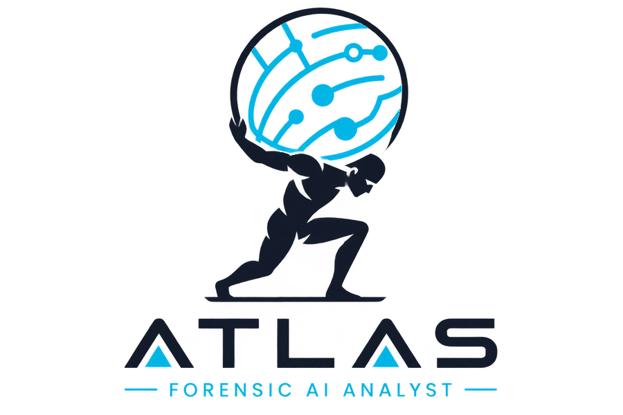
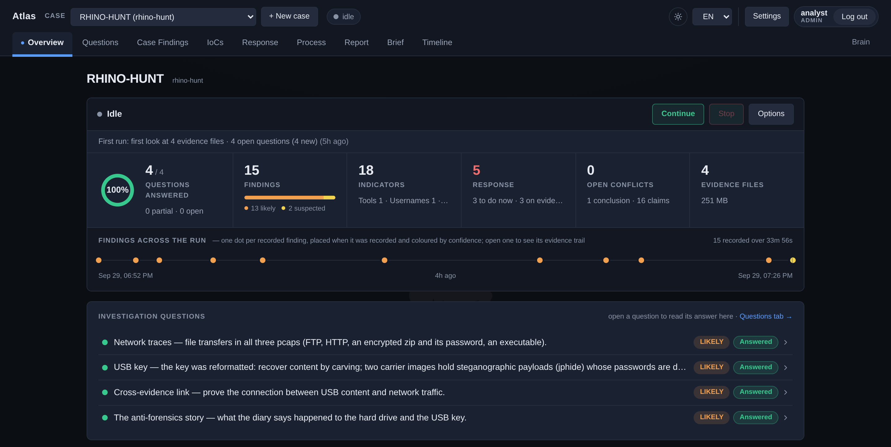
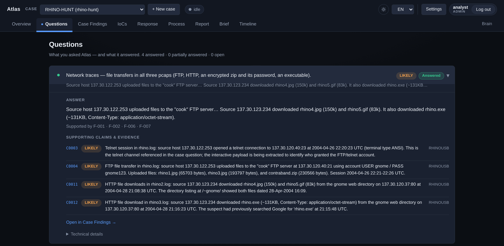
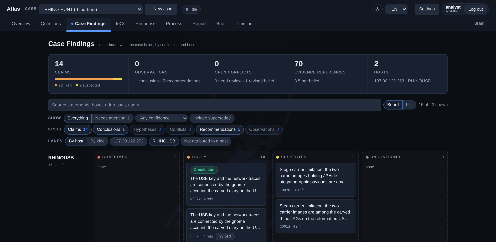
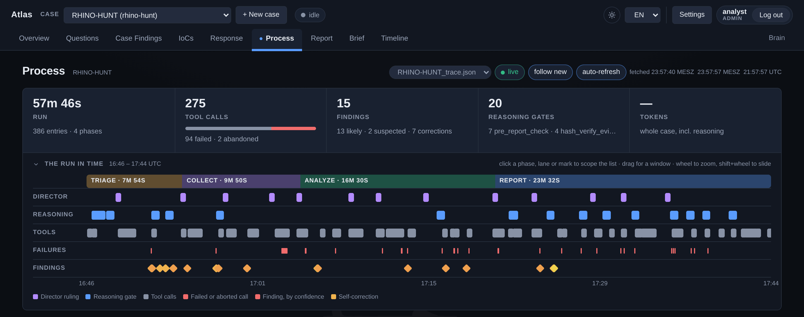

<p align="center">
  <picture>
    <source media="(prefers-color-scheme: dark)" srcset="dashboard/assets/logo.png">
    
  </picture>
</p>

<p align="center">
  <b>An autonomous DFIR agent. Point it at the evidence and get back an investigation that shows its work.</b>
</p>

<p align="center">
  
  
  
  
</p>

<p align="center">
  <a href="#try-it">Try it</a> ·
  <a href="#what-atlas-does">What it does</a> ·
  <a href="#install">Install</a> ·
  <a href="#configure-an-llm-backend">Models</a> ·
  <a href="#run-an-investigation">Run a case</a> ·
  <a href="#the-dashboard">Dashboard</a> ·
  <a href="#documentation">Docs</a>
</p>



Atlas is a Digital Forensics and Incident Response (DFIR) agent for malware analysis and rogue-actor attribution. Point it at disk images, memory dumps or log exports and it runs the whole investigation on its own (disk triage, memory forensics, Windows artifact parsing, IOC enrichment, YARA hunting, timeline building) without asking for confirmation at each step. It hands back a structured report and a click-through audit trail: every finding links to the tool call that produced it, and every answer lists the evidence behind it.

> In Greek myth, Atlas was the Titan tasked with bearing the weight of the sky so it would not fall. This one bears the weight of the investigation.

## Try it

You need no evidence and no API key: the repository ships finished investigations to open in the dashboard.

```bash
git clone https://github.com/AtlasFO/Atlas-Community.git ~/Atlas
cd ~/Atlas
./install.sh            # provisions the forensic toolchain; --yes runs it unattended
./dashboard.sh --demo   # serves the bundled investigations on http://127.0.0.1:8765
```

The first visit creates your admin account. Then pick **RHINO-HUNT**: a complete run on the public DFRWS 2005 "Rhino Hunt" challenge (a reformatted USB key and three network captures) with every question answered, the evidence behind each finding, the indicators, the response plan and the final report. For a fresh run of your own, [docs/datasets.md](docs/datasets.md) lists a bundled case brief and more public datasets to try.

> [!TIP]
> Ready for your own evidence? [Connect a model](#configure-an-llm-backend) and [start a case](#run-an-investigation), or follow the [guided first run](docs/try-it-out.md) from start to finish.

## What Atlas does

- **Investigates end to end.** Triage, collection, analysis and report run as phases, with no prompt for confirmation between steps.
- **Challenges its own conclusions.** Five model roles share the work. The analyst drives the investigation, a phase director decides what comes next from the evidence so far, an adversarial reviewer challenges every conclusion before it reaches the report, a report writer drafts the report, and a run reviewer grades runs for `atlas train`.
- **Shows its work.** Every finding links back to the exact tool call that produced it, every answer lists the claims and evidence behind it, and the Process view lays out the whole run in time.
- **Writes the report.** Answers to the case's questions, findings, indicators and a response plan, in English or German (chosen per case), as Markdown, HTML or PDF.
- **Works with your model.** Any OpenAI-compatible backend: OpenAI, a local or self-hosted server, any gateway, or the Telekom LLM Hub, which keeps case data on EU infrastructure. Nothing is pre-selected.
- **Uses your detection rules.** Drop a `.yar` file into `rules/`, in any sub-folder, and the next scan uses it ([details](docs/yara-rules.md)).
- **Answers follow-up questions.** *Ask Atlas* in the dashboard discusses the open case and runs forensic tools when it needs to.

## Install

Pick one of two ways:

1. **Normal install** (recommended for most people): a plain Ubuntu 24.04 or Debian 12 host, on bare metal, a VM, Docker or WSL2 on Windows. `install.sh` provisions the whole forensic toolchain itself. It is the fastest path if you don't already run SIFT and don't need its desktop toolkit.
2. **SIFT Workstation**: provision a SANS SIFT Workstation first, then run the same `install.sh` on top. It detects SIFT and installs only what SIFT did not already provide. Choose this if you want SIFT's full desktop toolkit (GUI tools, a broader manual-forensics workflow) alongside Atlas, or already run SIFT for other work.

Atlas needs **Python 3.11 or newer**. Ubuntu 24.04 and Debian 12 ship it; the `python3` of Ubuntu 22.04 is 3.10, so that release needs a newer one first.

**Minimum host:** 4 CPU cores (8 or more recommended), 8 GB RAM (32 GB or more recommended; Volatility 3 and Plaso are the memory-hungry tools), and 10 GB of disk for the install itself (the tools and Python packages take about 2 GB; the rest is headroom for distribution packages and .NET), plus room for your evidence: a single disk image is commonly 30 to 500 GB or more. Full breakdown: [INSTALL_INSTRUCTIONS.md](INSTALL_INSTRUCTIONS.md#0-get-a-host).

### Option 1: Normal install

```bash
git clone https://github.com/AtlasFO/Atlas-Community.git ~/Atlas
cd ~/Atlas
./install.sh
```

- Fully unattended: `./install.sh --yes`
- Prefer Docker? See [docs/docker.md](docs/docker.md): the same `install.sh`, run at image build time.
- Not on Debian or Ubuntu? [docs/other-distros.md](docs/other-distros.md) is a manual, unsupported starting point.
- Remove everything the installer added, any time: `./uninstall.sh` (it never touches your case evidence or `.env`).

### Option 2: SIFT Workstation

<details>
<summary>Provision SIFT with <code>cast</code>, then run the same installer</summary>

**1. Install `cast`**, the official installer for SIFT:

```bash
CAST_VERSION="$(curl -fsSL https://api.github.com/repos/ekristen/cast/releases/latest | grep -Po '"tag_name": "\K[^"]*')"
wget "https://github.com/ekristen/cast/releases/download/${CAST_VERSION}/cast-${CAST_VERSION}-linux-amd64.deb"
sudo dpkg -i "cast-${CAST_VERSION}-linux-amd64.deb"
```

`cast` ships versioned release file names, so resolving the current tag first, rather than hard-coding a version, keeps this working from release to release. On an arm64 host, swap `amd64` for `arm64` in both lines.

**2. Install the SIFT Workstation with `cast`:**

```bash
sudo cast install teamdfir/sift-saltstack
```

**3. Run Atlas's installer exactly as in Option 1.** There is no SIFT-specific variant: it checks every tool individually and installs only what is missing.

</details>

## Configure an LLM backend

Atlas needs a language model for its five roles. `install.sh` offers to set one up; to add or change one later:

```bash
bin/atlas provider setup
```

The wizard covers the Telekom LLM Hub, OpenAI, a local or self-hosted server (vLLM, Ollama, LM Studio, ...) and any other OpenAI-compatible endpoint, and it tests the connection before saving. The same setup lives in the dashboard under **Settings → Providers**, where the *Roles in a run* table gives each role its provider.

- **Use a large-context model.** Atlas is tuned for a 1 000 000-token context window. It probes the live model, scales every budget to its window and compresses the conversation before a request would overflow; below 32 000 tokens it runs in a compact, disk-first mode. Set `ATLAS_MODEL_CONTEXT_TOKENS` if the probe is wrong. Small-context and budget models tend to produce incomplete analysis and unexpected failures, and are not recommended.
- **Thinking models need no special setup.** Atlas reads the thinking from whichever field the provider uses and never mistakes it for the answer. Each provider has one Thinking setting; on Auto, a bounded level is learned the first time a reply comes back empty. *Test connection* reports what a model does before you give it a role.
- **Expect vendor dialects.** "OpenAI-compatible" is a family of dialects. Atlas adapts at runtime: it learns from a rejection that names the offending field, drops that field for the model and sends the request again. An unusual or very new model may still need a small adjustment; start with `core/llmhub.py` and `agent/llm.py`.

Everything in detail: [docs/llm.md](docs/llm.md).

> [!NOTE]
> Atlas is developed in Germany, and EU data protection (GDPR/DSGVO) shaped two choices: the Telekom LLM Hub is a first-class backend because it keeps case data on EU infrastructure, and reports and recommendations can be written in German as well as English. Neither is a requirement; every OpenAI-compatible backend is configured the same way and equally supported.

## Run an investigation

```bash
cp -r case-template ~/cases/<CASE_ID>
cp /path/to/evidence.E01 ~/cases/<CASE_ID>/evidence/
# edit ~/cases/<CASE_ID>/CASE.md: the investigation requests, and optionally
# what you already know (a theory, indicators from an alert, a time window)
cd ~/cases/<CASE_ID>
atlas run
```

Or create the case in the dashboard (*New case*: id, requests, report language) and press *Start*. A case that states no question is still investigated: Atlas asks the standard one, *What happened on the Host(s)?*, and says so.

Atlas writes a structured report to `reports/` and keeps a live, click-through audit trail in the dashboard (`./dashboard.sh`). Indicators and the response plan update as findings land, and whoever started the run is mailed when it ends, once an SMTP server is set under **Settings → Mail**.

| Command | What it does |
|---|---|
| `atlas run --case <dir> -q "..."` | Run an analysis against a case, from anywhere |
| `./dashboard.sh` | Browse cases, the live trace and reports in the dashboard |
| `atlas chat` | Interactive session: you drive, Atlas runs the tools |
| `atlas review --live` | Is a running investigation stuck? A read-only diagnosis |
| `atlas train -q "..."` | A clean run, then graded by an independent reviewer |
| `atlas doctor` | Which backend and model is each role actually using? |
| `atlas provider setup` | Add or repoint an LLM backend |

Full command list: [docs/cli-reference.md](docs/cli-reference.md), or `atlas --help` and `atlas <command> --help`.

## The dashboard

`./dashboard.sh` serves it on `http://127.0.0.1:8765` (LAN and HTTPS via `install.sh --with-dashboard-lan`). The first visit creates the admin account; users get one of three roles (viewer, analyst, admin), and sessions end after an idle timeout and an absolute limit the admin sets. Pages update themselves as a run writes; nothing needs a reload.

<table>
  <tr>
    <td width="50%" valign="top">
      
      <br><b>Questions</b>: every answer with the claims and evidence behind it
    </td>
    <td width="50%" valign="top">
      
      <br><b>Case Findings</b>: every belief by host and confidence, with its evidence references
    </td>
  </tr>
  <tr>
    <td colspan="2">
      
      <br><b>Process</b>: the run in time, from the director's rulings and the reasoning gates to every tool call, failure and finding
    </td>
  </tr>
</table>

Per case: **Overview** (one status band: run state, questions, findings, indicators, response, conflicts, evidence, plus the live activity line), **Questions**, **Case Findings** (every recorded belief by confidence and host), **IoCs**, **Response** (what to do about it, ordered by urgency and evidence), **Process** (the trace), **Report**, **Brief** (the case file) and, when the timeline addon is on, **Timeline**. **Settings** holds the model providers and their roles, token spend and prices, users, session limits and the activity log, cases, enrichment keys, the MITRE ATT&CK tables, tool health, plugins, the network share and mail, each in its own section. Full tour: [docs/dashboard.md](docs/dashboard.md).

## Documentation

| Get started | Use Atlas | Under the hood |
|---|---|---|
| [Try It Out](docs/try-it-out.md): a guided first run | [The dashboard](docs/dashboard.md) | [Architecture](docs/architecture.md) |
| [Install walkthrough and troubleshooting](INSTALL_INSTRUCTIONS.md) | [CLI guide](docs/cli.md) and [CLI reference](docs/cli-reference.md) | [Investigation state](docs/investigation-state.md) |
| [Docker](docs/docker.md) | [LLM backends](docs/llm.md) | [Directory layout](docs/directory-layout.md) |
| [Other distributions](docs/other-distros.md) | [Your own YARA rules](docs/yara-rules.md) | [Writing addons](docs/addons.md) |
| [xmount alongside GIFT's Plaso](docs/xmount-manual-install.md) | [Network share (SMB evidence intake)](docs/network-share.md) | [Bundled datasets](docs/datasets.md) |
| [Proxmox LXC container](docs/proxmox-lxc.md) | [Multi-user VM](docs/multi-user.md) | |

## License

[PolyForm Noncommercial 1.0.0](LICENSE): free for personal, home and evaluation use. Commercial or organizational (professional or enterprise) use requires a separate license from the copyright holder; open a [GitHub issue](../../issues) to discuss terms.

Third-party code and data distributed with Atlas keep their own licenses and are credited in [NOTICE](NOTICE); the tools Atlas installs on your machine but does not redistribute are inventoried in [THIRD-PARTY.md](THIRD-PARTY.md).

If Atlas is useful to you, consider [sponsoring the project](https://github.com/sponsors/AtlasFO).
