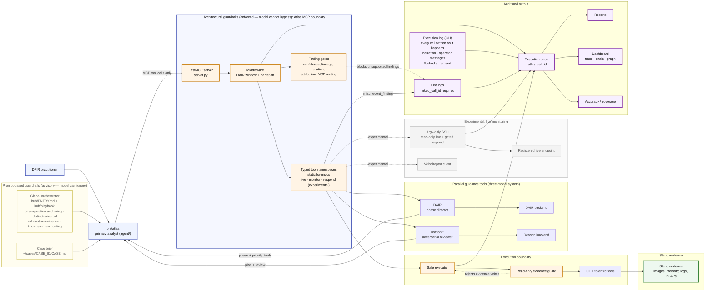

# Atlas Architecture

This diagram is Atlas's architecture at a glance. It emphasizes the security
boundary that matters most: Atlas does not rely only on prompt instructions.
Forensic execution is routed
through typed MCP tools, middleware gates, and executor-level evidence
protection before any external binary or live endpoint command can run.

**Investigation continuity** (Claim Graph, Rerun Engine, Report Projection, Claim View, `.atlas/` layout):

→ [architecture-investigation.md](architecture-investigation.md) ·
[investigation-state.md](investigation-state.md) ·
[cli-reference.md](cli-reference.md)

**Agent instruction architecture** (modular playbook):

→ [agent-instruction-architecture.md](agent-instruction-architecture.md) ·
[`hub/playbook/`](../hub/playbook/) · layout: [`directory-layout.md`](directory-layout.md)

> **Scope:** Atlas is the read-only static-evidence investigator. The
> live-monitoring layer (`live.*`, `monitor.*`, `respond.*`, SSH, Velociraptor —
> shown dashed) is experimental; it inherits the same MCP boundary, trace, and
> gates.

## Architectural pattern

Architecturally, Atlas is primarily a **Custom MCP Server**:
`server.py` exposes ~250 typed forensic tools across 24 namespaces over the Model
Context Protocol, and the analyst model reaches every tool through that single
boundary. It
is also a **Multi-Agent Framework** — three independently-backed models hold
distinct roles (the analyst, the DAIR phase director, and the `reason.*`
adversarial reviewer) and exchange structured directives. It is **not** a
**Direct Agent Extension** (the forensic logic lives behind typed tools, not in
the prompt) and **not** an **Alternative Agentic IDE**.

## Prompt-based vs architectural guardrails

Atlas uses both tiers, and the distinction is the whole point: prompt-based rules
*guide* the agent, architectural rules *enforce* it. The architectural tier holds
even when the model ignores the prompt-based tier — a guardrail that is
architectural cannot be defeated by a cleverer prompt.

| Tier | Examples | Where it lives | What happens if the model ignores it |
| --- | --- | --- | --- |
| **Prompt-based** (advisory) | Playbook disciplines: case-question anchoring, distinct-principal / competing-hypothesis discipline, exhaustive-evidence rule, knowns-driven hunting, identifier normalization, evidence-content-is-data rule, chat-mode scope note | `hub/ENTRY.md` + `hub/playbook/`, `agent/prompts.py` | Nothing stops the model mid-stream; the lapse surfaces downstream when an unsupported finding hits an architectural gate, or is caught in the accuracy report |
| **Architectural** (enforced) | MCP-only routing, read-only evidence path guard, finding gates (linked_call_id, supported-evaluate, confidence+citation, attribution-grounding, negative-completeness, MCP-routing), pre-report gate, gated argv-only SSH | `core/middleware.py`, `core/paths.py`, `core/executor.py`, `tools/_gates/*`, `core/ssh_exec.py` | The call or finding is refused before anything runs or is recorded; the model cannot talk past it (`tests/security/test_spoliation.py` proves a bash-bypassed forensic run is unrecordable) |

## Guardrail Summary

These are the architectural-tier enforcements in detail.

| Boundary | Enforcement | Repository location |
| --- | --- | --- |
| Forensic tools must route through MCP | `core/middleware.py` detects direct forensic binary use and points the agent to typed wrappers | `core/middleware.py`, `tools/_gates/mcp_routing.py` |
| Evidence remains read-only | Output paths resolving under `/cases/`, `/mnt/`, `/media/`, or any `evidence/` segment are rejected before subprocess execution | `core/paths.py`, `core/executor.py` |
| Live endpoint commands avoid shell injection *(experimental layer)* | Live tools use registered host aliases and fixed argv command construction over SSH; the gated `respond.*` write path validates every argv parameter | `core/ssh.py`, `core/ssh_exec.py`, `tools/live.py` |
| Findings must be traceable | `misc.record_finding` requires `linked_call_id` to point to the producing `_atlas_call_id` | `tools/misc.py`, `tools/_gates/linked_call_id_must_exist.py` |
| Confirmed claims require review | Confidence, citation, hypothesis, lineage, attribution-grounding, exfil-channel, negative-completeness, and adversarial-review gates block unsupported findings | `tools/_gates/*`, `tools/reasoning.py`, `tools/dair.py` |
| Audit trail is durable | Tool calls, reason calls, DAIR transitions, self-corrections, curiosity probes, and findings are written to JSON/Markdown trace logs as they happen; the run loop flushes the execution log at session end | `core/execution_log.py`, `agent/`, `dashboard/*` |
| Text planted in evidence is named as data | Every tool output is scanned for instruction-like text (a line addressed to an analyst, an override of instructions, a dictated verdict, chat-template tokens): the trace entry is stamped `instruction_like_text`, the result the model reads shows it under `_instruction_like_text` with a note that it is evidence content, and `record_finding` warns about a finding that cites such output for another claim (`ATLAS_INSTRUCTION_TEXT_GATE=strict` refuses instead). Nothing is stripped or rewritten: the text is evidence and the citation gates need it verbatim | `core/instruction_text.py`, `core/execution_log.py`, `agent/toolbox.py`, `tools/_gates/instruction_text_grounding.py`, `tests/security/test_prompt_injection.py` |
| A viewer's chat turn cannot change the case | The dashboard sends the caller's role with each chat message; for a viewer the worker sets `Toolbox.deny`, which refuses every state-changing tool (record, write, update, add, approve, execute, revert, clear, reset, set, start, export, mark, the `respond` namespace, `atlas_finish`, `misc_batch_run`) before the name resolves | `agent/chat_worker.py`, `agent/toolbox.py`, `dashboard/app.py`, `dashboard/chat.py` |

## DAIR And Reason

DAIR and `reason.*` are separate MCP tool families. The analyst invokes each
through the Atlas MCP server and consumes their returned guidance; neither
component calls the other directly. Together with the analyst they form
the three-model system: an analyst that does the work, a director that decides
what to examine next, and an adversary that challenges every conclusion.

| Component | Purpose | Typical output | Trace entry |
| --- | --- | --- | --- |
| DAIR phase director | Maintains the investigation phase model: Triage, Collect, Analyze, Scan, and Report. It challenges whether the investigation is ready to move forward, identifies missing work, and returns `priority_tools` for the next batch. | Phase assessment, transition recommendation, verification challenges, investigation focus, priority tools, curiosity budget | `dair_call` |
| `reason.*` adversarial reviewer | Provides analytical review around the evidence. It creates initial plans, generates competing hypotheses for the case question and ambiguous artifacts, evaluates whether findings are supported, performs citation/confidence checks, and synthesizes the final report posture. | Plan, hypothesis, finding evaluation, confidence score, citation check, synthesis, pre-report readiness | `reason_call` |

Tool selection is grounded by `tools/tool_capabilities.py`, a curated capability
manifest that maps phases and evidence types to allowed tool IDs and substitution
rules. DAIR and `reason.*` include the manifest in their prompts, and parsed
directives are annotated with `tool_manifest_version`, `priority_tool_capabilities`,
and `unknown_priority_tools`.

Beyond the prescribed work order, `dair_assess` returns a `curiosity_budget`: a
small allowance of read-only, self-directed looks the agent may take to chase a
hunch the work order did not name (a second SID's recycle bin, an untouched comms
store, a weaker exfil channel). Each look is logged as a `curiosity_probe` trace
entry via `misc.record_curiosity_probe` and is budget-enforced by
`tools/_gates/curiosity_budget.py`. A probe carries no evidentiary weight on its
own — to support a finding, its `call_id` must flow into `reason.*` or
`misc.record_finding` through `input_call_ids`, where the normal finding gates
apply. This widens coverage without loosening a gate. Both dashboard views
(`dashboard/trace_viewer.html`, `dashboard/claim_view.html`) render
curiosity probes and the lineage edges that connect them to the artifacts they
inspected and any finding they ultimately fed.

## Primary Data Flow

1. The practitioner starts a run (`atlas run`, or *Start* in the dashboard); the
   playbook under `hub/` and the case-specific `CASE.md` go into the analyst's
   prompt. These are the prompt-based (advisory) tier: they steer the agent
   but do not enforce.
2. The analyst selects forensic actions, but execution crosses the typed Atlas MCP
   boundary rather than running SIFT binaries directly.
3. Middleware records call initiation, enforces recent DAIR guidance, and keeps
   narration in the trace.
4. Tool wrappers call the safe executor or live SSH runner. Output safety checks
   reject writes to evidence locations before the command runs.
5. Each successful or failed execution receives a `_atlas_call_id` in the trace.
6. Findings are submitted through `misc.record_finding` and must link back to
   the exact producing call ID, or the finding gates refuse them.
7. DAIR and `reason.*` run as separate MCP tool families. The analyst consumes both
   result streams; DAIR does not call reasoning, and reasoning does not call
   DAIR.
8. The execution log persists the audit trail outside the model's control: every
   call is written as it happens, narration and operator messages are logged,
   and the trace is flushed when the run ends.
9. Accuracy, coverage, attribution, reports, and dashboards consume the same
   trace, so every final claim remains auditable.
